# 🎬 Videotube Backend

**Videotube** is a backend REST API for a video sharing platform (YouTube inspired) built using **Node.js**, **Express.js**, and **MongoDB**.  
It provides all core backend functionalities like user authentication, video management, subscriptions, likes, comments, tweets and channel analytics.

<br>

## Features

### Authentication
- Register, login, and logout users  
- Passwords securely hashed with **bcrypt**
- JWT-based authentication system   
- Cookie support with **cookie-parser**

### Video Management
- Upload, fetch, update, and delete videos  
- Cloud storage integration via **Cloudinary**  
- Thumbnails, views, and metadata management  
- Published/unpublished video visibility

### Engagement System
- Like and unlike videos  
- Subscribe/unsubscribe to channels  
- Comment and tweet system  
- View tracking and analytics

### Channel Dashboard
- Fetch total videos, subscribers, likes, and views  
- Summary statistics per user/channel  
- Real-time data from MongoDB aggregation

### Utility Features
- Centralized error and success responses using `ApiError` and `ApiResponse`  
- Async error handling middleware  
- Health check endpoint for API status  
- Environment variable configuration via `.env`

<br>

## Tech Stack

| Category | Technologies |
|-----------|---------------|
| **Language** | JavaScript (ES6+) |
| **Runtime** | Node.js |
| **Framework** | Express.js |
| **Database** | MongoDB with Mongoose ODM |
| **Authentication** | JWT, bcrypt |
| **Cloud Storage** | Cloudinary |
| **Utilities** | Multer, dotenv, nodemon |
| **Testing Tools** | Postman |

<br>

## Sequence Diagrams

### 1. Authentication Flow
_(Register → Login → Refresh Token → Accessing Protected Route → Logout)_

```mermaid
sequenceDiagram
    participant Client
    participant API
    participant Multer
    participant Cloudinary
    participant DB

    Note over Client,API: 🔐 Registration (avatar + coverImage optional)
    Client->>API: POST /auth/register (form-data)
    API->>Multer: Process uploaded files
    Multer->>Cloudinary: Upload avatar & cover image
    Cloudinary-->>API: File URLs
    API->>DB: Create user record
    DB-->>API: Success
    API-->>Client: User registered (tokens not issued yet)

    Note over Client,API: 🔑 Login
    Client->>API: POST /auth/login (email + password)
    API->>DB: Verify user
    DB-->>API: Valid user
    API-->>Client: accessToken + refreshToken (HTTP-only cookie)

    Note over Client,API: ♻ Refresh Access Token
    Client->>API: POST /auth/refresh-token
    API->>DB: Validate refresh token & user
    API-->>Client: New accessToken

    Note over Client,API: 🔒 Access Protected Routes
    Client->>API: GET /protected (Authorization: Bearer accessToken)
    API->>API: verifyJWT middleware checks token
    API-->>Client: Protected data

    Note over Client,API: 🚪 Logout
    Client->>API: POST /auth/logout
    API-->>Client: Refresh token cleared (cookie deleted)
```


<br>

### 2. Video Flow
_(Upload Video → Cloudinary → DB → Metadata Updates)_


<br>

### 3. Other Features (Comments, Likes, Subscriptions, Playlists, Tweets)

```mermaid
sequenceDiagram
    participant Client
    participant API
    participant verifyJWT
    participant DB

    Note over Client,API: 💬 Comments
    Client->>API: POST /comments/:videoId (add comment)
    API->>verifyJWT: Validate token
    API->>DB: Insert comment
    DB-->>API: OK
    API-->>Client: Comment added

    Client->>API: PATCH /comments/:commentId (update)
    API->>DB: Update comment
    API-->>Client: Updated

    Client->>API: DELETE /comments/:commentId
    API->>DB: Delete comment
    API-->>Client: Deleted


    Note over Client,API: 👍 Likes (Video / Comment / Tweet)
    Client->>API: POST /likes/toggle/v/:videoId
    API->>DB: Toggle video like (add/remove)
    API-->>Client: Updated like state

    Client->>API: POST /likes/toggle/c/:commentId
    API->>DB: Toggle comment like
    API-->>Client: Updated

    Client->>API: POST /likes/toggle/t/:tweetId
    API->>DB: Toggle tweet like
    API-->>Client: Updated


    Note over Client,API: 📺 Subscriptions
    Client->>API: POST /subscriptions/c/:channelId (toggle)
    API->>DB: Subscribe/unsubscribe
    API-->>Client: Subscription updated

    Client->>API: GET /subscriptions/me/subscribers
    API->>DB: Fetch subscribers list
    API-->>Client: Subscriber data


    Note over Client,API: 🎵 Playlists
    Client->>API: POST /playlists (create)
    API->>DB: Insert playlist
    API-->>Client: Created

    Client->>API: PATCH /playlists/add/:videoId/:playlistId
    API->>DB: Push video to playlist
    API-->>Client: Updated

    Client->>API: PATCH /playlists/remove/:videoId/:playlistId
    API->>DB: Pull video from playlist
    API-->>Client: Updated


    Note over Client,API: 🐦 Tweets
    Client->>API: POST /tweets (create)
    API->>DB: Insert tweet
    API-->>Client: Tweet posted

    Client->>API: PATCH /tweets/:tweetId (update)
    API->>DB: Update tweet
    API-->>Client: Updated

    Client->>API: DELETE /tweets/:tweetId
    API->>DB: Delete tweet
    API-->>Client: Deleted


```

<br>

## Installation & Setup

### 1. Clone the Repository
```bash
git clone https://github.com/ayuxi03/videotube-backend.git
cd videotube-backend
```

### 2. Install dependencies, set up `.env`, and start the server:
```bash
npm install
npm run dev
```

<br>

## Testing
Use Postman to try out the API routes for login, upload, likes, etc.

<br>

## Contribution
Contributions to the project are welcome! If you have suggestions or find any issues, please open an issue or submit a pull request.